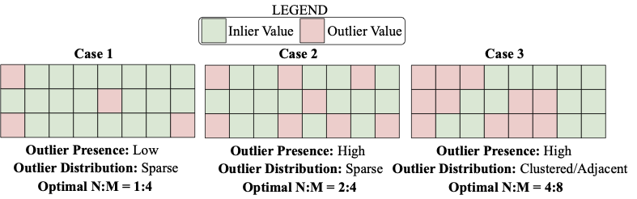

#  [Accelerating LLM Inference with Flexible N:M Sparsity via A Fully Digital Compute-in-Memory Accelerator]()

Official PyTorch implementation of  **FLOW:** (N:M Pruning) and Verilog RTL of **FlexCiM:** Flexible CiM Accelerator


<p align="center">

</p>

Example of efficient N:M assignment in different situations based on outlier presence and distribution. **FLOW** has the ability to identify optimal N:M value in all scenarios.

## Contributors
1. Akshat Ramachandran (Georgia tech)
2. Souvik Kundu (Intel Labs)

## News

- Received Best Paper Award nomination at ISLPED 2025!

- Accelerating LLM Inference with Flexible N:M Sparsity via A Fully Digital Compute-in-Memory Accelerator accepted to ISLPED 2025!

## Update
- [x] (04.2025) Added support for finetuning
- [x] (12.2024) Code release of N:M selection and pruning flow.
      
## Table of contents

* [Abstract](#abstract)

* [Installation](#installation)

* [Usage](#Usage)


## TL;DR
We propose a two-part solution to accelerate large language model (LLM) inference by enabling flexible, layer-wise N:M sparsity and deploying it efficiently on a novel digital compute-in-memory (DCiM) accelerator.


## Abstract
Large language model (LLM) pruning with fixed N:M
structured sparsity significantly limits the expressivity of the sparse model
yielding sub-optimal performance. On the contrary, support for more
than one N:M pattern to provide sparse representational freedom yields
a costly area overhead in hardware. To mitigate these challenges, for
LLMs, we first present a flexible layer-wise outlier-density-aware N:M
sparsity (FLOW) selection method. FLOW enables the identification of
optimal layer-wise N and M values (from a given range) by simultaneously
accounting for the presence and distribution of outliers allowing a higher
degree of representational freedom. To deploy the sparse models with such
N: M flexibility, we then present a flexible low overhead, digital compute-
in-memory architecture (FlexCiM). FlexCiM enables support for diverse
sparsity patterns by partitioning a DCiM macro into smaller sub-macros
which are adaptively aggregated and disaggregated through distribution
and merging mechanisms for different values of N and M. Extensive
experiments demonstrate FLOW outperforming existing alternatives with
an accuracy improvement of up to 30%, while FlexCiM delivers up
to 1.75× lower inference latency and 1.5× lower energy consumption
compared to the existing sparse accelerators.

## Installation 
### A) Docker Environment

Coming Soon!

### B) Native Install  
Step 1: Create a new conda environment:
```
conda create -n flow python=3.9
conda activate flow
```
Step 2: Install relevant packages
```
pip install -r requirements.txt
```


## Usage

### Example usage of identifying layerwise N:M ratios for llama-7b using FLOW 
---
```
cd sw/solver && \
python solver.py \
--model meta-llama/Llama-2-7b-hf \
--cache_dir llm_weights \
--seed 42 \
--nsamples 128 \
--dataset_name wikitext \
--dataset_config_name wikitext-2-raw-v1 \
--sparsity_ratio 0.7 \
--Hyper_m 0.5 \
--Lamda 0.2 \
--output_file layerwise_nm.txt
```
**Explanation:** This script identifies optimal layer-wise N:M ratios, following the FLOW methodology (Section 4.B in paper) and saves the layer-wise N:M ratios to a user-defined file.


### Example usage of pruning llama-7b using FLOW 
---
```
cd sw && \
python main.py \
--model meta-llama/Llama-2-7b-hf \
--cache_dir llm_weights \
--seed 42 \
--nsamples 128 \
--dataset_name wikitext \
--dataset_config_name wikitext-2-raw-v1 \
--prune_method from_file \
--input_file layerwise_nm.txt \
--sparsity_type None \
--Hyper_m 3.0 \
--Lamda 0.2 \
--outlier_by_wmetric \
--save_model pruned_models/llama2-7b-flow
```

**Explanation:** Uses the identified layer-wise N:M to prune the model.

### Example usage of pruning llama-7b using fixed N:M 
---
```
cd sw && \
python main.py \
--model meta-llama/Llama-2-7b-hf \
--cache_dir llm_weights \
--seed 42 \
--nsamples 128 \
--dataset_name wikitext \
--dataset_config_name wikitext-2-raw-v1 \
--prune_method fixed \
--sparsity_type 4:8 \
--Hyper_m 3.0 \
--Lamda 0.2 \
--outlier_by_wmetric \
--save_model pruned_models/llama2-7b-fixed
```

**Explanation:** Prunes all layers using the same N:M ratio.
 
### Zero-shot evaluation

#### Step1: Data Generation: 

```
cd sw/zero_shot_benchmark/scripts/data_generation && bash run.sh 
```
#### Step2: Obtain prediction:
```
cd sw/zero_shot_benchmark/scripts/benchmark && \
mkdir results && \
bash run.sh 
```
Note: To use pruned model for prediction, in run.sh set local_saved_model to args.save_model in main.py and model to args.model in main.py. 
#### Step3: Evaluate: 
```
cd sw/zero_shot_benchmark/scripts/benchmark && bash eval.sh
```

###  Finetuning  on Alpaca

The fine-tuning code is based on [alpaca-lora](https://github.com/tloen/alpaca-lora/tree/8bb8579e403dc78e37fe81ffbb253c413007323f) and [SPP](https://github.com/Lucky-Lance/SPP/tree/main). Please refer to the [SPP](https://github.com/Lucky-Lance/SPP/tree/main) repository for additional details about the dataset (which is already provided as part of this codebase)

The provided environment in requirements.txt should cover the dependecies of both these repositories.

Install the PEFT requirements:
```bash
cd peft
pip install -e .
```
This will install `PEFT 0.2.0`. Note: If the installed transformers complains about requiring PEFT >= 0.5.0, please remove that assertion from transformers for conformity.


## Training 

Step 1: Running
```bash
cd fine_tuning/SPP
bash run.sh
```
Note: --local_saved_model corresponds to the pruned and locally saved model using FLOW whereas --base_model corresponds to the HF name of the corresponding model.

Step 2: Then you will get the trained model in --output_dir, with 
```
.
├── adapter_config.json
├── adapter_model.bin
├── checkpoint-1000
├── checkpoint-200
├── checkpoint-400
├── checkpoint-600
├── checkpoint-800
└── completed
```

Step 3: Merge the adapters with original model using `export_hf_checkpoint.py`.
In this file, replace `BASE_MODEL` with your --local_saved_model and `ckpt_path` with --output_dir. Then run the script. You will get the merged model.

## FlexCiM RTL
FlexCiM Verilog RTL and testbench available here: ```hw/ ```

## Results
### Qwen2.5-3B Results

| Method           | BoolQ | MMLU | HellaSwag |
|------------------|-------|------|-----------|
| Baseline         | 77.1  | 65.6 | 74.6      |
| 60% Sparsity     | 66.3  | 51.7 | 56.3      |
| Post fine-tuning | 69.5  | 54.6 | 58.2      |


### Acknowledgement
This repository is based upon the [Wanda](https://github.com/locuslab/wanda), [SparseGPT](https://github.com/IST-DASLab/sparsegpt), [OWL](https://github.com/luuyin/OWL/tree/main) repositories.


## Citation
if you find this repo is helpful, please cite

```
@article{ramachandran2025accelerating,
  title={Accelerating llm inference with flexible n: M sparsity via a fully digital compute-in-memory accelerator},
  author={Ramachandran, Akshat and Kundu, Souvik and Raha, Arnab and Kundu, Shamik and Mathaikutty, Deepak K and Krishna, Tushar},
  journal={arXiv preprint arXiv:2504.14365},
  year={2025}
}
```
